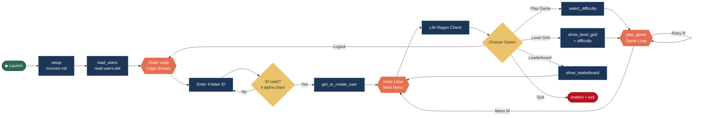
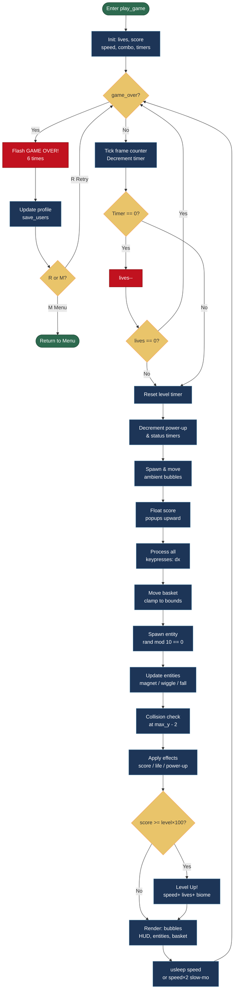
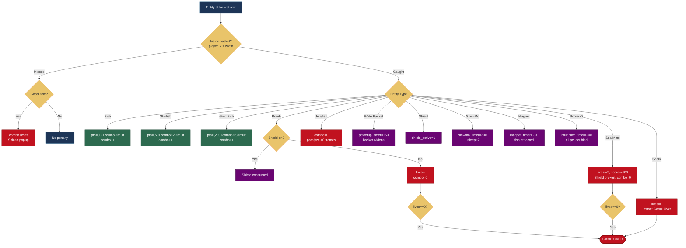
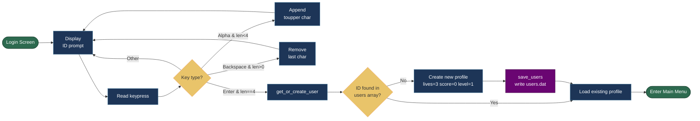

# 🐟 HUNGRY FISH — Terminal Arcade Game

> A fully-featured, classic-style arcade game built entirely in **C** using the `ncurses` terminal graphics library. Catch fish, dodge hazards, race the clock, and climb the leaderboard — all from your terminal!

---

## 📋 Table of Contents

1. [Overview](#overview)
2. [Libraries Used](#libraries-used)
3. [Compilation & Running](#compilation--running)
4. [Game Flow & State Machine](#game-flow--state-machine)
5. [User Authentication & Profiles](#user-authentication--profiles)
6. [Life Regeneration System](#life-regeneration-system)
7. [Main Menu](#main-menu)
8. [Difficulty Selection](#difficulty-selection)
9. [Level Grid](#level-grid)
10. [Leaderboard](#leaderboard)
11. [Gameplay Mechanics](#gameplay-mechanics)
12. [Entities & Items](#entities--items)
13. [Power-Ups](#power-ups)
14. [Obstacles & Hazards](#obstacles--hazards)
15. [Level Progression & Timers](#level-progression--timers)
16. [Environmental Biomes](#environmental-biomes)
17. [Visual System & Animations](#visual-system--animations)
18. [Controls Reference](#controls-reference)
19. [Data Persistence](#data-persistence)
20. [Flowchart](#flowchart)
21. [Algorithm](#algorithm)
22. [Architecture Overview](#architecture-overview)

---

## Overview

**Hungry Fish** is a terminal-based arcade game where the player controls a basket at the bottom of the ocean screen. Items fall from the top of the screen — catch the good ones (fish, starfish, gold fish) to score points, collect power-ups to gain abilities, and dodge hazards like bombs, sea mines, jellyfish, and sharks.

The game features:
- Persistent player profiles with a 4-letter ID system
- 3 difficulty levels that scale game speed and time limits
- A dynamic level timer that forces urgency
- 3 environmental biomes that change the game's look and feel
- A leaderboard tracking score and best survival time
- A life bank system with real-time regeneration between sessions

---

## Libraries Used

| Library | Header | Purpose |
|---|---|---|
| **ncurses** | `<ncurses.h>` | All terminal UI: color pairs, key input, cursor control, screen drawing |
| **stdlib** | `<stdlib.h>` | `rand()`, `srand()`, `qsort()`, memory management |
| **time** | `<time.h>` | `time(NULL)` for Unix timestamps (life regen, survival timer) |
| **unistd** | `<unistd.h>` | `usleep()` for frame rate control |
| **stdio** | `<stdio.h>` | `fopen/fread/fwrite/fclose` for binary save file I/O |
| **string** | `<string.h>` | `strcmp`, `strcpy`, `snprintf`, `memcpy` for string & memory ops |
| **ctype** | `<ctype.h>` | `isalpha()`, `toupper()` for validating player ID input |

### Why `ncurses`?
`ncurses` (New Curses) is a library that provides an API for drawing text-based UIs in Unix terminals. It handles:
- **Color pairs**: Defining foreground/background color combinations
- **Non-blocking input**: Via `nodelay()` and `getch()`, so the game loop doesn't wait for keypresses
- **Cursor control**: `mvprintw(y, x, ...)` places text at exact coordinates
- **Screen buffering**: `erase()` + `refresh()` provides smooth rendering without flicker

---

## Compilation & Running

### Prerequisites
You need the `ncurses` development library installed.

- **macOS**: Pre-installed with Xcode Command Line Tools.
- **Ubuntu/Debian**: `sudo apt-get install libncurses5-dev`

### Compile
```bash
gcc -o fish_game /path/to/(enteryourdownloadfilepath!).c -lncurses
```
The `-lncurses` flag links the ncurses library at compile time.

### Run
```bash
./fish_game
```

> **Note:** The game creates a `users.dat` binary file in the directory where you run it. This stores all player profiles and progress.

---

## Game Flow & State Machine

The `main()` function implements a multi-level state machine:

```
App Start
    └── load_users() from users.dat
    └── [LOOP] login_screen()
            └── get_or_create_user()
            └── [LOOP] main_menu()
                    ├── Play Game
                    │       └── select_difficulty()
                    │       └── [LOOP] play_game() → returns 0 (Menu) or 1 (Retry)
                    ├── Level Grid
                    │       └── show_level_grid()
                    │       └── select_difficulty()
                    │       └── [LOOP] play_game()
                    ├── Leaderboard → show_leaderboard()
                    ├── Logout → return to login_screen()
                    └── Quit → endwin() + exit
```

This architecture means the game loop is entirely self-contained in `play_game()`. It returns an integer (`0` = go to menu, `1` = retry) which the outer loop uses to decide what to do next.

---

## User Authentication & Profiles

### The `UserProfile` Struct
```c
typedef struct {
    char id[5];         // 4-letter player ID (uppercase)
    int high_score;     // All-time highest score
    int max_level;      // Highest level ever reached (unlocks Level Grid)
    int stored_lives;   // Lives banked between sessions
    long last_life_regen; // Unix timestamp of last life regeneration
    int best_time;      // Best total survival time in seconds
} UserProfile;
```

### Login / Registration (`login_screen`)
- On launch, the player is prompted to type a **4-letter alphabetic ID** (e.g., `ARYA`).
- Input is validated character-by-character using `isalpha()`. Non-letters are ignored.
- Input is uppercased with `toupper()`.
- Backspace is supported (`KEY_BACKSPACE`, `127`, `\b` are all handled for cross-terminal compatibility).
- The ID must be exactly 4 characters before Enter is accepted.
- `get_or_create_user()` searches the loaded `users[]` array for a matching ID. If found, returns the existing profile. If not, creates a new profile with default values (`stored_lives = 3`, `high_score = 0`, etc.) and saves immediately.

### Profile Persistence
- Up to `100` user profiles are stored in a flat binary array in `users.dat`.
- On startup: `load_users()` reads the count (`num_users`) then the full `UserProfile` array.
- On change: `save_users()` overwrites the entire file with the current in-memory state.

---

## Life Regeneration System

Lives are **persistent** and shared across all sessions. They are not reset when you start a new game — you use whatever lives are stored in your profile.

### Rules
- Maximum lives: **5**
- Regeneration rate: **+1 life every 5 minutes** (300 seconds)
- Regeneration is calculated using Unix timestamps. Every time the main menu is shown:
  ```
  elapsed = now - last_life_regen
  lives_to_add = elapsed / 300
  ```
- If `lives_to_add > 0`, the stored lives are incremented and `last_life_regen` is advanced by `lives_to_add * 300` seconds.

### Display in Main Menu
- Full hearts are shown as `[<3]` in red/bold.
- Empty heart slots are shown as `[   ]` dimmed.
- If lives are not full, a live countdown shows: `Next life in: 04:32`
- If lives are full: `Lives full!` is shown in green.

---

## Main Menu

The main menu is a navigable list rendered by `main_menu()`. Navigation uses Arrow Keys or W/S. Selection uses Enter.

| Option | Action |
|---|---|
| **Play Game** | Goes to difficulty select, then starts a new game from Level 1 |
| **Level Grid** | Opens the level selection grid, then difficulty select |
| **Leaderboard** | Shows the top 10 players sorted by score |
| **Logout** | Returns to the login screen to switch users |
| **Quit** | Calls `endwin()` and exits cleanly |

The menu also shows the player's **ID, High Score, Max Level, current stored lives, and life regen countdown**.

---

## Difficulty Selection

Shown via `select_difficulty()` before every game session. The difficulty affects:

| Setting | Easy | Medium | Hard |
|---|---|---|---|
| Base game speed | 110,000 µs/frame | 75,000 µs/frame | 45,000 µs/frame |
| Base basket speed | 5 | 7 | 9 |
| Base level timer | 90 seconds | 60 seconds | 40 seconds |

Game speed is in microseconds per frame (`usleep(speed)`). Lower = faster.

---

## Level Grid

`show_level_grid()` renders a **5×5 grid** (25 levels displayed) to let players jump into a level they have previously unlocked.

- **Unlocked levels** (≤ `user->max_level`) show their number: `[  5 ]`
- **Locked levels** show `[ ** ]` in dim text
- Navigation: Arrow Keys / WASD
- Select: Enter (only works on unlocked cells)
- Back: Q

Each time you level up in a game, `user->max_level` is updated and saved, gradually unlocking more cells in the grid.

---

## Leaderboard

`show_leaderboard()` sorts all user profiles and displays the top 10.

### Sorting Logic (`compare_users`)
- Primary sort: **High Score** (descending)
- Tiebreaker: **Best Survival Time** (descending — longer survival wins)

### Display Columns
```
RANK  ID    SCORE   LVL  BEST TIME
  1.  ARYA  12500   8    02:34
  2.  JOHN   9800   6    01:55
```

---

## Gameplay Mechanics

### The Game Loop
`play_game()` runs a `while(!game_over)` loop. Each iteration represents one **frame**. The speed of the game is controlled by `usleep(speed)` at the end of each frame.

Each frame:
1. Increment frame counter, tick the level timer
2. Update all timers (power-ups, cooldowns, animations)
3. Spawn and update ambient bubbles
4. Update floating score popups
5. Process all keyboard input
6. Spawn new falling entities
7. Move entities downward, check collisions
8. Render everything to screen
9. Sleep for `speed` microseconds

### Basket Movement
- The basket moves by accumulating `dx` from all keypresses in the input queue.
- Movement is capped at ±30 pixels per frame to prevent teleporting.
- `basket_speed` increases with level and difficulty.
- The basket is clamped to screen boundaries using `player_x` and `basket_width`.

### Collision Detection
When an entity reaches `max_y - 2` (just above the floor):
- If `entity.x >= player_x - 2` AND `entity.x <= player_x + basket_width` → **CAUGHT**
- Otherwise → **MISSED** (combo reset if it was a fish/starfish/gold fish)

### Combo System
- Every consecutive catch of a good item (fish, starfish, gold fish) increments `combo`.
- Missing a good item resets `combo` to 0.
- Combo multiplies the point value: `pts = (base_pts + combo) * score_multiplier`

---

## Entities & Items

All game objects share the `Entity` struct:
```c
typedef struct {
  int x, y;    // Screen position
  int type;    // One of the TYPE_* constants
  int active;  // 1 = on screen, 0 = available for reuse
  int dir;     // Used by sharks: +1 = moving right, -1 = left
} Entity;
```

A pool of **12 Entity slots** is used. Each frame, if `rand() % 10 == 0`, the code scans for the first inactive slot and spawns a new entity based on a weighted random table.

### Loot Table (Weighted Random)

| Roll Range | Entity Type | Notes |
|---|---|---|
| 0–39 | Fish | Most common |
| 40–54 | Starfish | Moderate |
| 55–64 | Jellyfish | Obstacle |
| 65–79 | Bomb / Mine / Shark | Hazards (scaled by level) |
| 80–85 | Wide Basket Power-up | |
| 86–89 | Shield Power-up | |
| 90–92 | Slow Motion Power-up | |
| 93–94 | Magnet Power-up | |
| 95–96 | Score Multiplier | |
| 97–99 | Gold Fish | Rarest, highest value |

---

## Power-Ups

| Symbol | Name | Effect | Duration |
|---|---|---|---|
| `(+)` | **Wide Basket** | Expands basket from `\___/` to `\_________/` | 150 frames |
| `(S)` | **Shield** | Absorbs one Bomb hit. Does NOT stop Mines. | Until hit |
| `(~)` | **Slow Motion** | Doubles `usleep` duration, halving game speed | 200 frames |
| `(M)` | **Magnet** | Pulls fish/starfish/gold fish toward the basket each frame | 200 frames |
| `[x2]` | **Score Multiplier** | Doubles all point gains (applied after combo math) | 200 frames |

---

## Obstacles & Hazards

| Symbol | Name | Effect |
|---|---|---|
| `(B)/(b)/(*)` | **Bomb** | Resets combo. Costs 1 life (Shield absorbs it) |
| `[X]` | **Sea Mine** | Costs 2 lives, -500 score penalty, instantly breaks Shield |
| `~@~` | **Jellyfish** | Wiggles horizontally. On catch: resets combo + paralyzes basket for ~40 frames |
| `==///>` / `<\\\\==` | **Shark** | Does NOT fall. Swims horizontally. Instant Game Over on contact. Spawns at Level 8+ |

### Paralysis (Jellyfish Effect)
When `paralyze_timer > 0`, the input handler ignores all movement keys (A/D/Arrow/Space). The player is completely frozen. This is shown in the top HUD as `[ZAPPED!]`.

### Abyssal Darkness (Level 8+)
At Level 8 and above, entities more than 10 rows above the basket or more than 15 columns away are **not rendered**. This creates a "darkness" effect where the player can only see items about to hit them.

---

## Level Progression & Timers

### Score Threshold
To advance to the next level: `score >= level * 100`

- Level 1 → 2 requires 100 points
- Level 2 → 3 requires 200 points
- etc.

### Time Limit Per Level
`level_time_limit = base_time - (level - 1) * 5` (minimum 15 seconds)

- Easy Level 1: 90s, Level 5: 70s, Level 15: 15s
- Medium Level 1: 60s, Level 5: 40s, Level 10: 15s
- Hard Level 1: 40s, Level 5: 20s

### Timer Logic
A **frame counter** tracks elapsed time. Each frame, `frame_count++`. When `frame_count >= frames_per_second` (derived from `speed`), one second is deducted from `level_secs_left`.

- Timer shown in HUD: `TIME: 42`
- Flashes **red bold** when ≤ 10 seconds remaining
- If timer hits 0: lose 1 life, timer resets. If 0 lives remain: Game Over.

### Time Bonus
When leveling up: `time_bonus = level_secs_left * 5` points are awarded instantly. A floating popup shows `TIME BONUS +XXX!`

### Level Up Effects
- +1 life awarded
- Timer resets for new level's time limit
- Game speed increases (`speed -= 2000`)
- Basket speed increases (`basket_speed++`)
- Biome may change (see Biomes)
- `update_environment(level)` re-initializes all color pairs

---

## Environmental Biomes

The `update_environment(level)` function re-initializes all 10 ncurses color pairs based on the current level. This changes the background and foreground colors of every element.

| Biome | Levels | Background | Feel |
|---|---|---|---|
| **Shallow Reef** | 1–3 | Cyan | Bright, tropical, beginner-friendly |
| **Deep Ocean** | 4–7 | Blue | Darker, more threatening |
| **Abyssal Trench** | 8+ | Black | Pitch dark, limited visibility |

---

## Visual System & Animations

### Color Pairs
ncurses uses numbered color pairs (foreground + background). The game uses 10 pairs:
- Pair 1: Items / fish
- Pair 2: Starfish / gold / level up banner
- Pair 3: Hazards (bombs, mines, sharks)
- Pair 4: Basket / multiplier
- Pair 5: Jellyfish / wide basket power-up
- Pair 6: Shield
- Pair 7: Slow motion
- Pair 8: Magnet
- Pair 9: Background / bubbles
- Pair 10: Sea Mine

### Ambient Bubbles
Every 4 frames, if `rand() % 4 == 0`, a `Bubble` is spawned at the bottom of the screen at a random X. Each frame, bubbles rise (`y--`) and drift slightly left or right. They're drawn with `.`, `o`, or `O` based on their `size` field.

### Floating Score Popups
The `Popup` struct holds position, text, color, and a lifetime counter. When an entity is caught, `add_popup()` finds the first inactive popup slot and fills it. Each frame, popups float upward (`y--` every 2 frames) and their `life` counts down. Rendered with `A_BOLD`.

### Entity Animations
Entities use frame-based animation by cycling through different ASCII strings based on `items[i].y / 2 % N`:
- **Fish**: Alternates `><(((*>` ↔ `<*))><`
- **Gold Fish**: Alternates `><$$$>` ↔ `<$$$><`
- **Starfish**: Cycles `-*-` → `-+-` → `*-*`
- **Bomb**: Cycles `(B)` → `(b)` → `(*)`
- **Shark**: Directional — `==///>` (right) or `<\\\\==` (left)

### Pause Screen
When `P` is pressed, the game enters a blocking `while(1)` loop drawing a flashing `** PAUSED **` banner (alternates every 300ms using `time(NULL) % 2`). Press `P` to resume or `Q` to quit.

### Game Over Sequence
1. Flash "GAME OVER!" 6 times (alternating 250ms intervals)
2. Show final screen: Score, Level Reached, Time Survived (MM:SS)
3. Prompt: `R` to retry, `M` for menu

---

## Controls Reference

| Key | Action |
|---|---|
| `A` / `←` | Move basket left |
| `D` / `→` | Move basket right |
| `Space` | **Dash** — burst movement in last direction (40-frame cooldown) |
| `P` | Pause / Unpause |
| `Q` | Quit game immediately |
| `W` / `↑` | Navigate menus up |
| `S` / `↓` | Navigate menus down |
| `Enter` | Confirm menu selection |
| `R` | Retry (on Game Over screen) |
| `M` | Return to menu (on Game Over screen) |

---

## Data Persistence

### File: `users.dat`
A binary file written in the game's working directory.

**Format:**
```
[int: num_users]
[UserProfile[0]]
[UserProfile[1]]
...
[UserProfile[num_users-1]]
```

`UserProfile` is a fixed-size C struct, so `fwrite`/`fread` serialize it directly as raw bytes. This is fast but not portable across platforms with different `int` sizes or endianness.

### When is data saved?
- On new user creation
- On life regeneration (when lives are re-added)
- On Game Over (score, max level, best time, remaining lives)
- On level up (stored lives updated mid-game)

> ⚠️ **Important:** If the `UserProfile` struct is changed (fields added/removed), existing `users.dat` files will be **incompatible** and must be deleted before running the updated binary.

---

## Flowchart

The diagrams below capture the complete lifecycle of the game — from the moment the binary is launched to the point where the player exits.

> **Colour key:** 🟢 Start / End &nbsp;|&nbsp; 🔵 Process &nbsp;|&nbsp; 🟡 Decision &nbsp;|&nbsp; 🟠 Loop / State &nbsp;|&nbsp; 🔴 Game Over / Exit

---

### 1. Overall Application Flow



---

### 2. Game Loop Frame Cycle



---

### 3. Collision & Scoring Decision Tree



---

### 4. User Authentication Flow



---

## Algorithm

The following section breaks down each core system of Hungry Fish into clear, numbered steps.

---

### Algorithm 1 — Main Game Loop

**Step 1:** Initialize all variables from difficulty and start level:
- `speed` (frame delay in µs), `lives` (from user profile), `score = 0`, `combo = 0`
- Allocate `entity_pool[12]`, `bubble_pool[20]`, `popup_pool[10]`

**Step 2:** Enter the main `while (!game_over)` loop.

**Step 3 — Timer Tick:** Increment `frame_count`. When `frame_count >= (1,000,000 / speed)`:
- Reset `frame_count = 0`, decrement `level_secs_left`, increment `total_secs`
- If `level_secs_left <= 0`: decrement `lives`. If `lives == 0` → game over. Else reset timer.

**Step 4 — Power-up Countdowns:** Decrement all active timers (powerup, slowmo, magnet, dash, paralyze, multiplier). Set `basket_width = 11` if powerup active, else `5`.

**Step 5 — Ambient Effects:**
- With 1-in-4 chance, spawn a new bubble at random x at the screen bottom
- Move all active bubbles upward (`y--`), drift x by ±1, deactivate if `y < 0`
- Float active popups upward every 2 frames; decrement their lifetime

**Step 6 — Process Input:** Drain the input queue:
- `Q` → set `game_over = TRUE`
- `P` → enter blocking pause loop
- If not paralyzed: `A/LEFT` subtracts from `dx`; `D/RIGHT` adds; `SPACE` triggers dash
- Clamp `dx` to `[-30, 30]`, apply to `player_x`, clamp `player_x` to screen bounds

**Step 7 — Spawn Entity:** If `rand() % 10 == 0`, find the first inactive slot in `entity_pool` and assign a type using the weighted loot table (see Algorithm 2).

**Step 8 — Update Entities:**
- Sharks: move horizontally, check proximity collision → instant game over
- Others: apply magnet pull if active; wiggle jellyfish; increment `y`
- If entity reaches `max_y - 2`: run collision check (see Algorithm 3)

**Step 9 — Level Up Check:** If `score >= level * 100`:
- Award time bonus, increment level and lives, increase speed and basket speed
- Recalculate time limit, reset timer, call `update_environment(level)`

**Step 10 — Render Frame:** Call `erase()`, draw bubbles → HUD → power-up bars → level-up splash → popups → entities → basket → `refresh()`.

**Step 11 — Frame Rate Control:** Call `usleep(speed * 2)` if slow-motion active, else `usleep(speed)`. Go to Step 2.

**Step 12 — Game Over Sequence:** Flash "GAME OVER!" 6 times. Display final score, level, time survived. Update and save user profile. Wait for `R` (retry) or `M` (menu).

---

### Algorithm 2 — Entity Spawning (Weighted Loot Table)

**Step 1:** On each frame, check if `rand() % 10 == 0`. If not, skip spawning.

**Step 2:** Scan `entity_pool[0..11]` for the first slot where `active == 0`.

**Step 3:** Set `entity.x = rand() % (max_x - 4)`, `entity.y = 1`.

**Step 4:** Roll `r = rand() % 100` and select type from the table below:

| Roll | Type | Probability |
|------|------|-------------|
| 0–39 | Fish | 40% |
| 40–54 | Starfish | 15% |
| 55–64 | Jellyfish | 10% |
| 65–79 | Bomb / Mine / Shark | 15% (level-scaled) |
| 80–85 | Wide Basket | 6% |
| 86–89 | Shield | 4% |
| 90–92 | Slow Motion | 3% |
| 93–94 | Magnet | 2% |
| 95–96 | Score x2 | 2% |
| 97–99 | Gold Fish | 3% |

**Step 5:** For the hazard band (65–79), roll `r2 = rand() % 10`:
- If `level >= 8` and `r2 < 2` → **Shark** (spawn near floor, random direction)
- If `level >= 4` and `r2 < 5` → **Mine**
- Otherwise → **Bomb**

**Step 6:** Set `entity.active = 1` and break out of the scan loop.

---

### Algorithm 3 — Collision Detection

**Step 1:** Check if the entity is a **Shark**:
- If `entity.x` is within 4 columns of the basket AND `entity.y >= max_y - 4` → return `shark_hit` (instant game over)
- Otherwise → return `no_hit` and skip falling logic

**Step 2:** For all other entities, check if `entity.y >= max_y - 2` (reached basket row).
- If **No** → entity is still in flight; continue to next frame

**Step 3:** Check horizontal overlap:
- If `entity.x >= player_x - 2` AND `entity.x <= player_x + basket_width` → return `caught`
- Otherwise → return `missed`

**Step 4:** On `caught` → apply the entity's effect (score, life change, power-up activation). Set `entity.active = 0`.

**Step 5:** On `missed` → if entity was a good item (fish/starfish/gold fish), reset `combo = 0`. Show splash popup. Set `entity.active = 0`.

---

### Algorithm 4 — Combo & Score Calculation

**Step 1:** Determine the score multiplier: `mult = 2` if `multiplier_timer > 0`, else `mult = 1`.

**Step 2:** Look up base points by entity type:
- **Fish** → `pts = (10 + combo) × mult`
- **Starfish** → `pts = (50 + combo × 2) × mult`
- **Gold Fish** → `pts = (200 + combo × 5) × mult`
- **Other** → `pts = 0`

**Step 3:** Add `pts` to `score`.

**Step 4:** If `pts > 0` (a good item was caught), increment `combo` by 1.

**Step 5:** If a good item was **missed**, reset `combo = 0`.

**Step 6:** Display a floating popup showing `+pts` at the entity's last position.

---

### Algorithm 5 — Level Progression

**Step 1:** After every collision, check if `score >= level * 100`.

**Step 2:** If the threshold is met:
- Calculate `time_bonus = level_secs_left * 5`
- Add `time_bonus` to `score` and show "TIME BONUS +N!" popup

**Step 3:** Increment `level` by 1. Increment `lives` by 1.

**Step 4:** Increase difficulty:
- `speed = MAX(speed - 2000, 15000)` (faster frames)
- `basket_speed += 1`

**Step 5:** Recalculate level timer:
- `level_time_limit = MAX(base_time - (level - 1) * 5, 15)`
- Reset `level_secs_left = level_time_limit`

**Step 6:** Update biome: call `update_environment(level)` which re-initializes all 10 color pairs.

**Step 7:** Update the user's profile: `user.max_level = MAX(user.max_level, level)`, then call `save_users()`.

**Step 8:** Trigger "LEVEL UP!" flash animation for 40 frames.

---

### Algorithm 6 — Life Regeneration

**Step 1:** Every time the Main Menu is rendered, get the current Unix timestamp: `now = time(NULL)`.

**Step 2:** Calculate elapsed seconds since last regen: `elapsed = now - user.last_life_regen`.

**Step 3:** Calculate lives to add: `to_add = elapsed / 300` (integer division; 1 life per 5 minutes).

**Step 4:** If `user.stored_lives < 5` AND `to_add > 0`:
- Add `to_add` to `user.stored_lives`, capping at 5
- Advance `user.last_life_regen += to_add * 300`
- Call `save_users()`

**Step 5:** Calculate the countdown to the next life:
- `secs_until_next = 300 - (now - user.last_life_regen)`

**Step 6:** Display in the HUD:
- If `stored_lives >= 5` → show **"Lives full!"** in green
- Otherwise → show **"Next life in: MM:SS"** using `secs_until_next`

---

## Architecture Overview

```
main()
├── setup()              — initscr, color, srand
├── load_users()         — fread users.dat
│
└── [Outer Loop]
    ├── login_screen()   — 4-letter ID input → get_or_create_user()
    └── [Inner Loop]
        ├── main_menu()          — life regen check + menu render
        ├── select_difficulty()  — returns 1/2/3
        ├── show_level_grid()    — 5x5 level selector
        ├── show_leaderboard()   — qsort + render top 10
        └── play_game(user, start_level, difficulty)
            ├── Init variables
            ├── [Game Loop]
            │   ├── Tick timer / frame counter
            │   ├── Update power-up timers
            │   ├── Spawn/move ambient bubbles
            │   ├── Float popups
            │   ├── Process input queue
            │   ├── Spawn entities (loot table)
            │   ├── Move entities + collision
            │   ├── Level up check (score >= level*100)
            │   └── Render frame
            ├── Game Over sequence
            ├── save_users()
            └── Return 0 (menu) or 1 (retry)
```

---

## File Location

- **Source Code**: `gemini-code-1777621178639.c`
- **Compiled Binary**: `fish_game_updated` (in scratch directory)
- **Save File**: `users.dat` (created on first run, in working directory)
- **README**: This file

---

*Built with 💙 in pure C. No external game engines, no frameworks — just a terminal and `ncurses`.*
